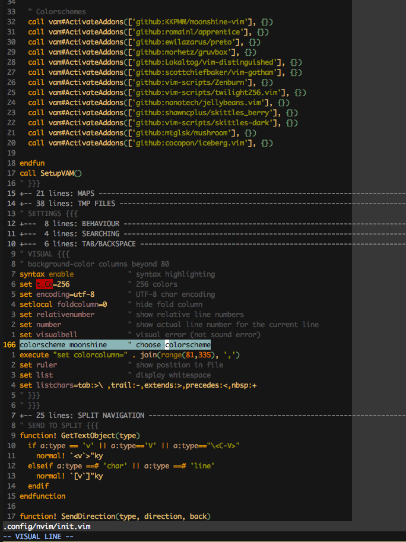
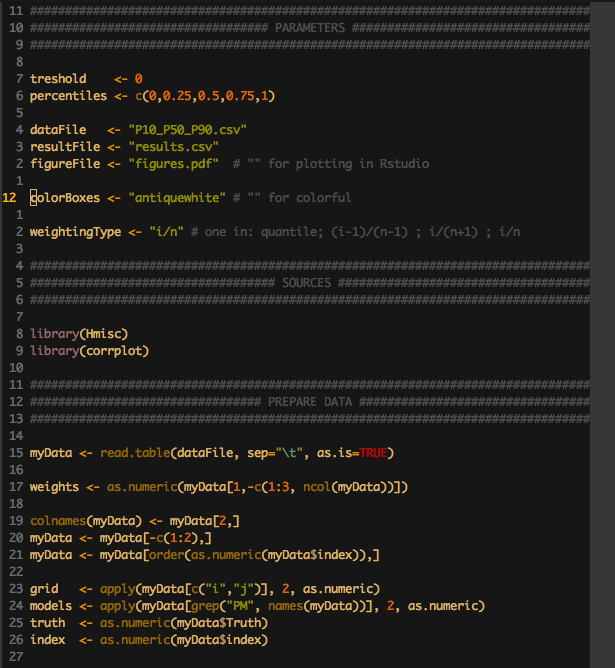

# moonshine-vim #

Moonshine is a dark terminal-only colorscheme for vim.

### Inspirations ###

Main inspirations:

1. [Apprentice](https://github.com/romainl/Apprentice)
2. [Twilight](https://github.com/vim-scripts/twilight256.vim)
3. [Gruvbox](https://github.com/morhetz/gruvbox)

### Screenshots ###

Some screenshots:

#### Vim ####

#### R ####

#### Bash ####

### Shortcomings ###

* Still young and subject to possible changes.
* Optimized for the kind of files I work with (might not transfer to other
filetypes well).
* Only usable on supporting 256 colors (no GUI version for now)

